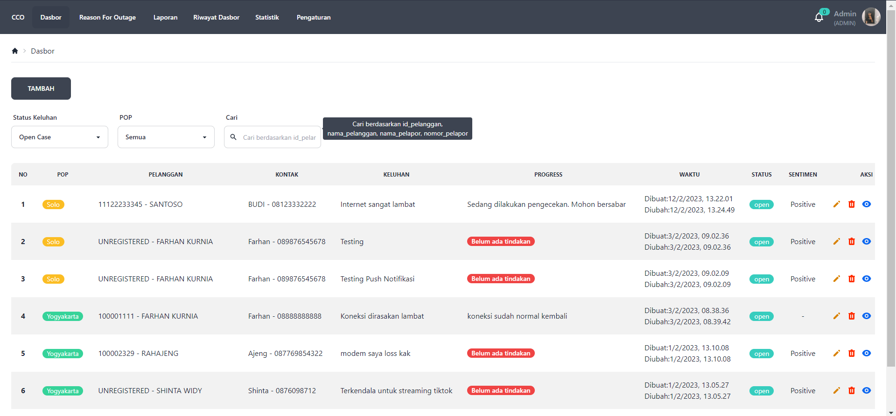
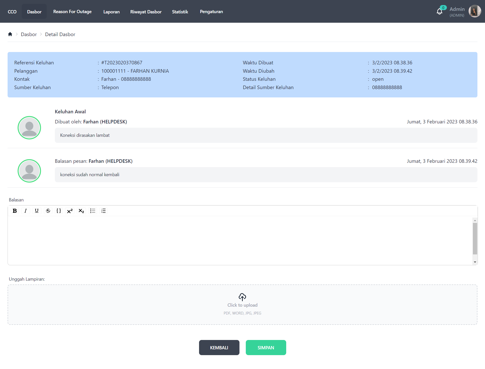
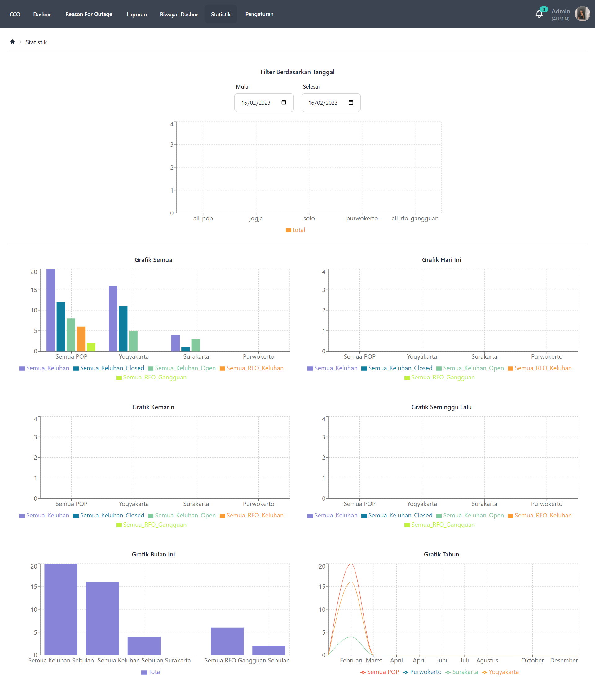
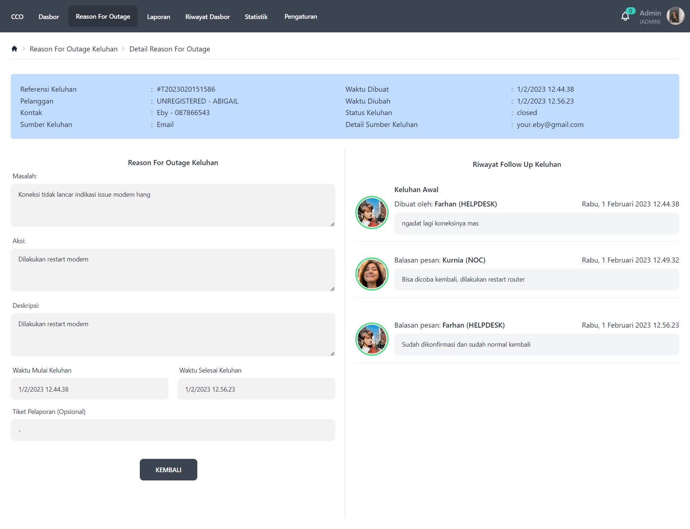
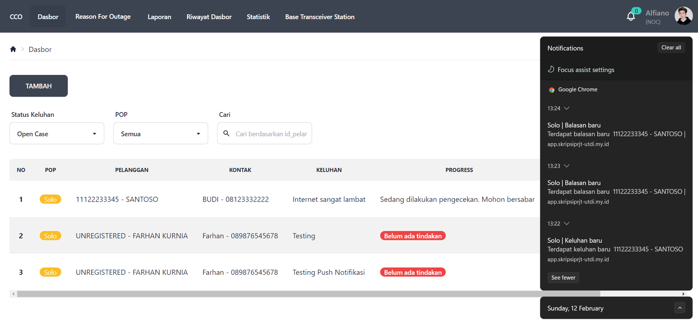

# Frontend End Aplikasi CCO (Customer Care) ISP

## Deskripsi

Aplikasi ini dibangun menggunakan React Javascript sebagai framework frontend, DaisyUI sebagai framework CSS dan Redux Toolkit JS sebagai state management.

Aplikasi yang diperuntukan perusahaan ISP untuk menghandle keluhan pelanggan supaya setiap keluhan pelanggan dapat tercatat dan terlihat progress penangannya. Dengan seperti ini management perusahaan ISP dapat melihat report secara realtime dan dari sisi pelanggan tidak merasa terabaikan. 

## Status Project

Aplikasi ini sudah dapat diakses secara publik atau bisa dikatakan sudah ada dilevel production. Tapi kedepannya masih ada improvement dari sisi fitur dengan menyesuaikan feedback dari users.

## Tanggapan Layar Aplikasi

### Login


### Keluhan


### Balasan (Progress)


### Statistik


### Reason For Outage


### Push Notifikasi



## Teknologi

Berikut ini teknologi yang digunakan pada project ini

    1. React Javascript (Framework Frontend)
    2. DaisyUI / TailwindCSS (Framework CSS)
    3. PusherJS (Library Realtime Notification)
    4. Service Worker (Mendukung proses push notifikasi)
    5. Redux Toolkit Js (State Management)
    6. Formik (Library Form)
    7. Authemtication (JWT Token)

## Cara Menjalankan Project

1. Instal Nodejs dan NPM sebagai syarat untuk menjalankan ReactJS
2. Kloning atau copy project sehingga dapat dijalankan dilocal.
```
git clone https://github.com/afifalfiano/filter-ticket.git
```
3. Setelah itu jalankan installasi project dengan perintah
```
npm install
```
4. Untuk menjalankan project dilocal dengan level development cukup jalankan perintah
```
npm run start
```
5. Untuk build project dilevel production cukup jalankan perintah
```
npm run build
```

## Fitur
1. Login
2. Registrasi + Verifikasi Email
3. Forget Password
4. Keluhan (Auth JWT + Admin || Non Admin)
        a. Index Data Keluhan
        b. Filter + Pencarian
        b. Tambah (Lampiran atau tanpa lampiran)
        c. Edit
        d. Hapus
        e. Detail (Progress penyelesaian keluhan)
        f. Rollback Status (dari selesai ke open)
        g. Selsaikan Keluhan dengan RFO Keluhan
        h. Selesaikan Keluhan dengan RFO Gangguan

5. Balasan (Progress Keluhan) (Auth JWT + Admin || Non Admin)
        a. Tambah (Lampiran atau tanpa lampiran)
6. RFO Keluhan (Auth JWT + Admin || Non Admin)
        a. Index
        b. Filter + Pencarian
        c. Tambah
        d. Edit
        e. Detail
7. RFO Gangguan (Auth JWT + Admin || Non Admin)
        a. Index
        b. Filter + Pencarian
        c. Tambah
        d. Edit
        e. Hapus
        f. Detail
8. Laporan (Auth JWT + Admin || Non Admin)
        a. Index
        b. Filter + Pencarian
        c. Tambah
        d. Detail
        e. Cetak
        f. Hapus
9. Riwayat Keluhan (Auth JWT + Admin || Non Admin)
        a. Index
        b. Filter + Pencarian
        c. Detail
        d. RFO Keluhan
        e. RFO Gangguan
        f. Rollback Status (dari selesai ke open)
10. Statistik (Auth JWT + Admin || Non Admin)
        a. Grafik by filter tanggal
        b. Grafik Semua
        c. Grafik Hari ini
        d. Grafik Kemarin
        f. Grafik Seminggu Lalu
        g. Grafik Bulan Ini
        h. Grafik Tahun
11. Notifikasi (Auth JWT + Admin || Non Admin)
        a. Push notifikasi keluhan dan balasan
11. Profil (Auth JWT + Admin || Non Admin)
        a. Ganti password
        b. Ganti foto profil
12. Menu BTS (Base Transceiver Station) (Auth JWT + Non Admin)
        a. Index
        b. Filter + Pencarian
12. Pengaturan (Auth JWT + Admin)
    
    a. BTS (Base Transceiver Station)
        1. Index
        2. Filter + Pencarian
        2. Tambah
        3. Edit
        4. Hapus
        5. Detail
    b. Pengguna
        1. Index
        2. Pencarian
        3. Nonaktifkan Pengguna
        4. Aktifkan Pengguna
    c. POP (Area Operasional)
        1. Index
        2. Tambah
        3. Edit
        4. Hapus
        5. Pencarian
    d. Sumber Keluhan
        1. Index
        2. Pencarian
        3. Tambah
        4. Edit
        5. Hapus
    e. Otoritas
        1. Index
        2. Pencarian
        3. Tambah
        4. Edit
        5. Hapus
    f. Shift
        1. Index
        2. Pencarian
        3. Tambah
        4. Edit
        5. Hapus

## Integrasi Backend
Untuk intergrasi dengan backend dan database dapat kunjungi link repository project disini ```https://github.com/FarhanKurnia/REST-API-CCO-LUMEN```

